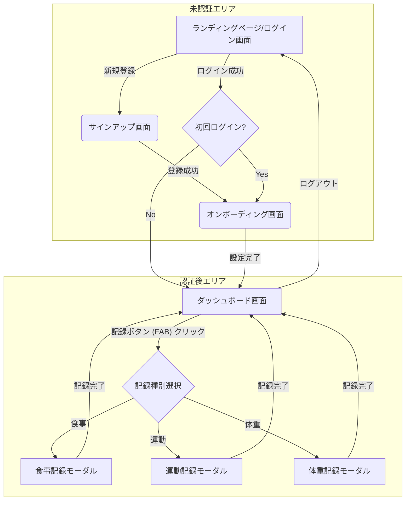

このドキュメントは、ユーザーが直接触れるアプリケーションのインターフェースと体験、すなわちシステムの「見た目と振る舞い」を定義します。

## 第1部: 画面遷移図

アプリケーション全体のユーザーフローと画面間の関係性を定義します。

## 第2部: UIワイヤーフレーム

各画面のレイアウト、配置されるコンポーネント、および情報構造を定義します。

### 2.1. 認証画面 (ログイン、サインアップ)

| 要素 | 説明 |
| :--- | :--- |
| **ロゴ** | アプリケーションのロゴを画面上部に配置 |
| **入力フォーム: メールアドレス** | `email`型の入力フィールド。 |
| **入力フォーム: パスワード** | `password`型の入力フィールド。 |
| **主要ボタン** | 「ログイン」または「サインアップ」ボタン |
| **代替アクションリンク** | 「アカウントをお持ちでないですか?」または「すでにアカウントをお持ちですか?」へのリンク。 |

### 2.2. オンボーディング画面 (プロフィール・目標設定)

| 要素 | 説明 |
| :--- | :--- |
| **タイトル** | 「ようこそ！」「目標を設定しましょう」など |
| **入力フォーム: プロフィール** | 身長(cm)、現在の体重(kg)、活動レベル(選択式: 低い/普通/高い)などを入力。 |
| **入力フォーム: 目標** | 目標体重(kg)、目標期日 (カレンダー選択)などを入力。 |
| **完了ボタン** | 「はじめる」ボタン。クリックするとダッシュボードへ遷移。 |

### 2.3. ダッシュボード画面

複雑なチャートは排し、シンプルさと情報の即時性を重視したレイアウトとします。

| 要素 | 説明 |
| :--- | :--- |
| **ヘッダー** | 日付表示エリア:「昨日」「今日」「明日」を切り替えるシンプルな日付ナビゲーター。 |
| **メインコンテンツエリア** | `<DailySummaryNumbers>` コンポーネント: ・摂取カロリー: `1500 / 2000 kcal` のように「実績/目標」を大きく表示。 ・消費カロリー: `300 kcal` のように実績値を表示。 |
| | `<PFCProgressBars>` コンポーネント: ・タンパク質(P)、脂質(F)、炭水化物(C)のそれぞれについて、目標グラム数に対する現在の摂取量をシンプルなプログレスバーで表示。バーの下には `P: 80 / 100g` のように数値を併記。 |
| | **ログリスト**: その日に記録した食事、運動のリストを時系列で表示。 |
| **フローティングアクションボタン (FAB)** | 画面右下に常に表示される「+」アイコンの円形ボタン。クリックすると記録種別選択のアクションシートが表示される。 |

### 2.4. 記録モーダル

#### 2.4.1. 食事記録モーダル

| 要素 | 説明 |
| :--- | :--- |
| **検索バー** | 食品をキーワードで検索するための入力フィールド。 |
| **検索結果リスト** | 検索キーワードに一致した食品名とブランド名がリスト表示される。各項目はクリック可能。 |
| **数量入力フォーム** | (リスト項目クリック後に表示) ・食品名: 選択した食品名。 ・数量: 数値入力フィールド。 ・単位: 選択式(例: g, 個, 皿)。 |
| **記録ボタン** | 「この食事を記録する」ボタン |

#### 2.4.2. 運動記録モーダル

消費カロリーはユーザーの手動入力とします。

| 要素 | 説明 |
| :--- | :--- |
| **入力フォーム: 運動名** | テキスト入力フィールド。 |
| **入力フォーム: 実施時間** | 数値入力フィールド (単位: 分) |
| **入力フォーム: 消費カロリー**| 数値入力フィールド (単位: kcal)。 |
| **記録ボタン** | 「この運動を記録する」ボタン |

#### 2.4.3. 体重記録モーダル

| 要素 | 説明 |
| :--- | :--- |
| **入力フォーム: 体重** | 数値入力フィールド (単位: kg) |
| **記録ボタン** | 「今日の体重を記録する」ボタン |

## 第3部: 詳細ユーザーストーリー

各機能がユーザーに提供する価値と振る舞いを「受け入れ基準」として明確に定義します。

* **US-01: 新規ユーザー登録**
    * **ユーザーとして、** 私はEメールとパスワードで新しいアカウントを作成したい。
    * **なぜなら、** アプリケーションを使い始めたいからだ。
    * **受け入れ基準:**
        * Given: ユーザーがサインアップ画面にいる。
        * When: 有効なメールアドレスとパスワードを入力し、「サインアップ」ボタンをクリックする。
        * Then: アカウントが作成され、オンボーディング画面にリダイレクトされる。

* **US-02: 食事の記録**
    * **ユーザーとして、** 私は食べたものをキーワードで検索し、量を入力して記録したい。
    * **なぜなら、** 日々の摂取カロリーと栄養素を追跡したいからだ。
    * **受け入れ基準:**
        * Given: ユーザーがダッシュボード画面にいて、FABから「食事」を選択した。
        * When: 検索バーに「鶏むね肉」と入力し、表示されたリストから該当項目を選択し、数量を「150g」と入力して「記録する」ボタンをクリックする。
        * Then: 食事記録モーダルが閉じ、ダッシュボードの数値とプログレスバーが更新され、ログリストに「鶏むね肉 150g」が追加される。

*(他のユーザーストーリーも同様に記述)*

## 第4部: UIモックアップ (ビジュアルデザイン指針)

本資料はワイヤーフレーム（構造）の定義に留めます。実際のUIモックアップ（見た目）は、別途デザインツールで作成されることを想定しますが、その際の基本的なデザイン指針を以下に示します。

* **カラースキーム**: 健康や信頼感を想起させる、クリーンで落ち着いた配色（例: グリーン、ブルー、ホワイトを基調）。
* **タイポグラフィ**: 可読性の高いサンセリフ体のフォントを使用。数値情報は大きく、見やすく表示する。
* **インタラクション**: スムーズで控えめなアニメーションを適用し、心地よい操作感を提供する。
* **情報密度**: MVPでは機能を絞っているため、各画面は余白を十分に取り、情報過多にならないようシンプルに構成する。

---

## 第5部: React Native アプリ設計

### 5.1 画面とフロー（最小）

- 画面: ログイン/サインアップ、オンボーディング、ダッシュボード、記録モーダル（食事/運動/体重）
- ナビゲーション: React Navigation のスタック/タブ最小構成
- ステート管理: Apollo Client（GraphQL） + React Context（認証）

### 5.2 認証/設定

- Cognito（Amplify Auth or cognito-identity-provider SDK）
- Web と同一の GraphQL 契約を使用（型生成を共有）

### 5.3 コード生成と共有

- `backend/schema.graphql` を単一のソースとして codegen（TypeScript 型/operations）
- Web/RN で共通パッケージに配置し再利用（モノレポの場合は `packages/api-types` 等）

---

## 第6部: Web/RN 共通 GraphQL 層

### 6.1 スキーマ駆動

- GraphQL スキーマを唯一の真実の源泉とし、両クライアントの型/queries/mutations を生成

### 6.2 キャッシュ・オフライン

- 初期はオンライン前提。将来は RN のみオフライン対応（キャッシュ永続化）を検討

### 6.3 エラーハンドリング

- 認証エラーはグローバルハンドラで捕捉しサインイン画面へ退避